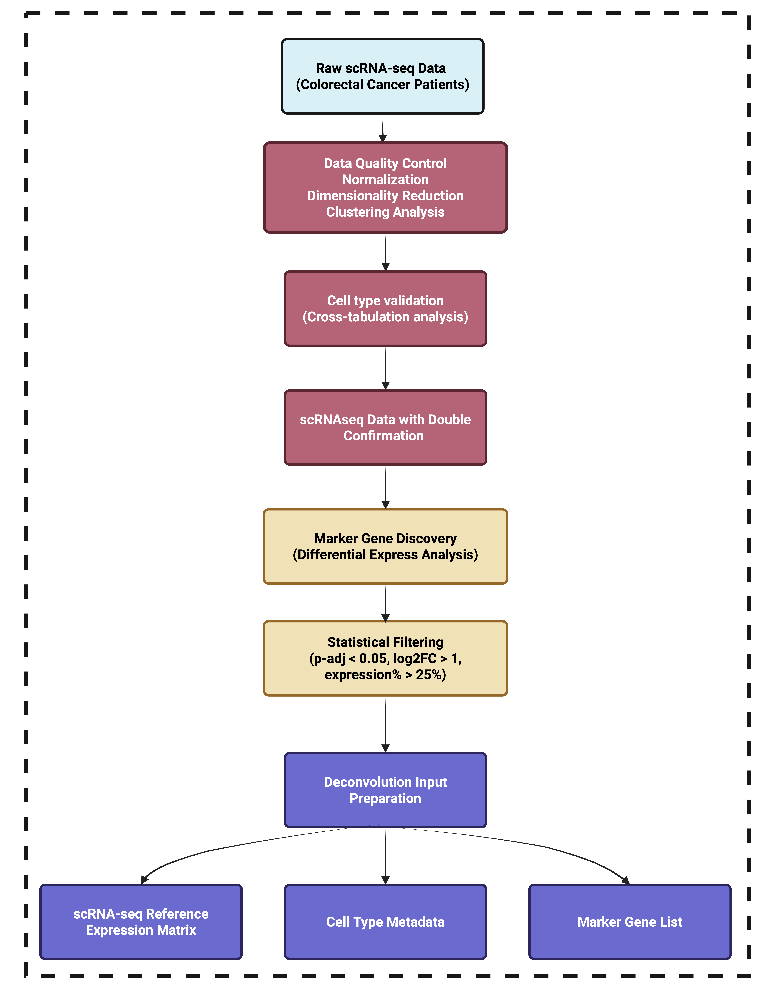

# STPath-COAD Workflow

## Overview

This folder contains the complete computational workflow for STPath-COAD (from data preparation to model training and validation). The workflow is organized into sequential steps that process raw data into trained models for cell type proportion prediction.

## Workflow Overview

**Figure 1.** Overall schematic of the STPath-COAD workflow.

## Supplementary Methods Overview

### Data Processing Pipeline

**Figure S9.** 

**Figure S10.** 

## Dependencies

### Python Dependencies
- `scanpy`: Single-cell analysis
- `pandas`, `numpy`: Data manipulation
- `torch`, `torchvision`: Deep learning
- `xgboost`: Machine learning
- `PIL`, `cv2`: Image processing
- `matplotlib`, `seaborn`: Visualization

### R Dependencies
- `CARD`: Spatial deconvolution
- `Seurat`: Single-cell analysis
- `dplyr`, `tidyr`: Data manipulation

### Foundation Models
- **Conch**: Requires HuggingFace access
- **UNI2h**: Requires HuggingFace access  
- **ProvGigapath**: Requires HuggingFace access
- **Virchow/Virchow2**: Requires HuggingFace access

